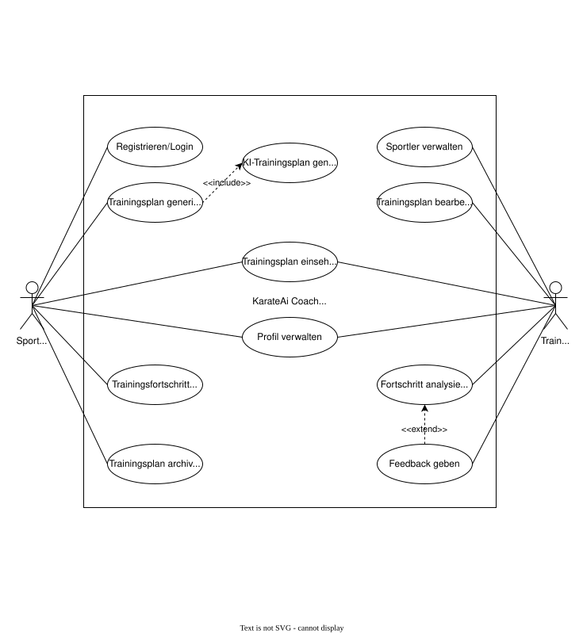
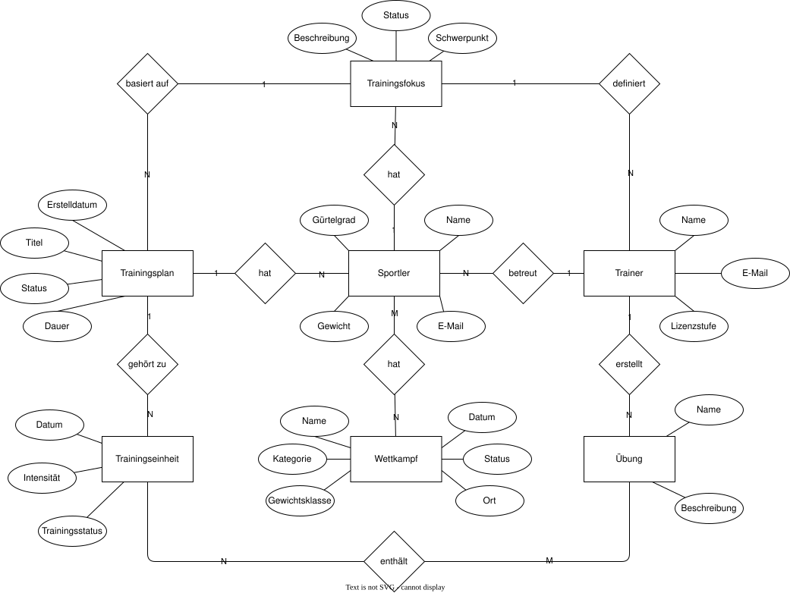
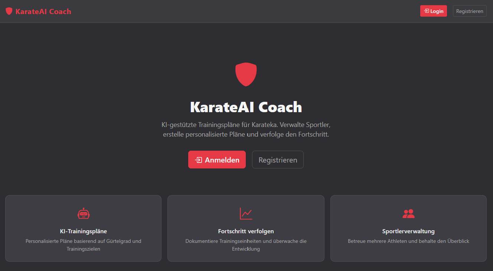
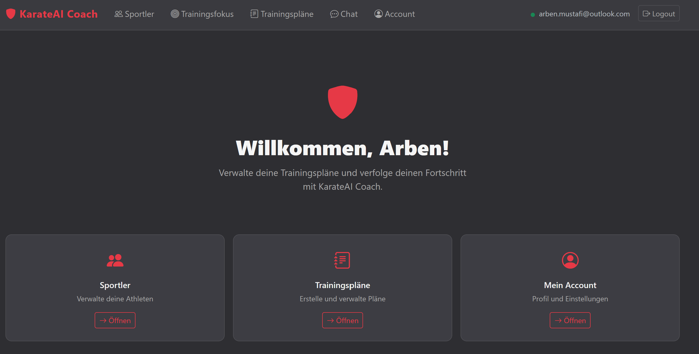
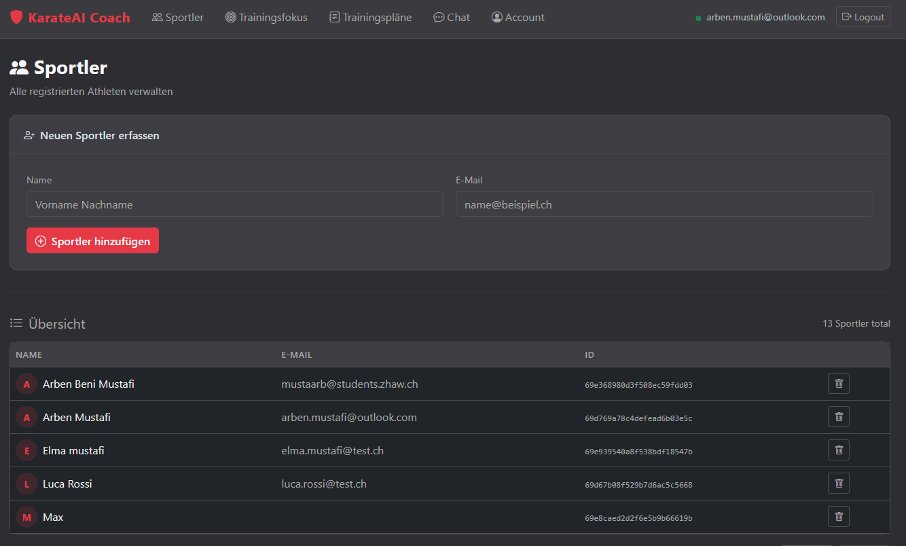
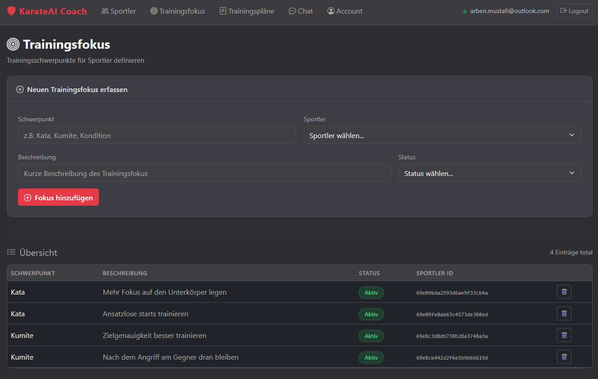
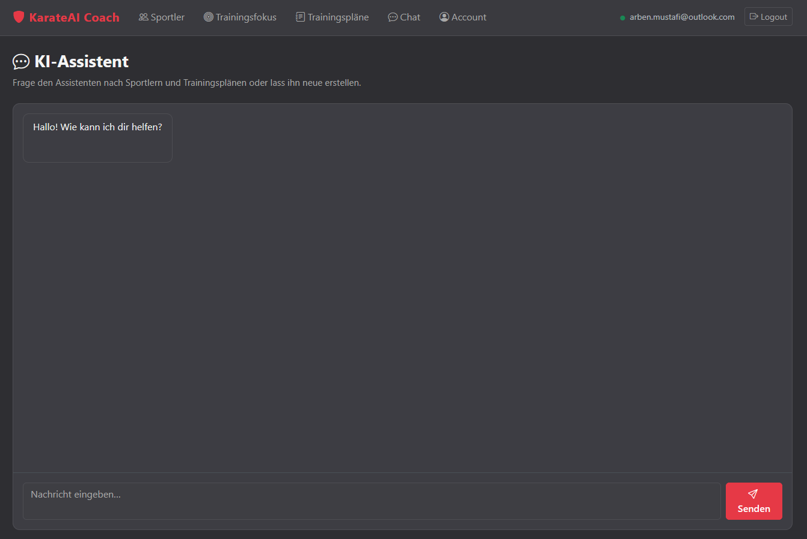
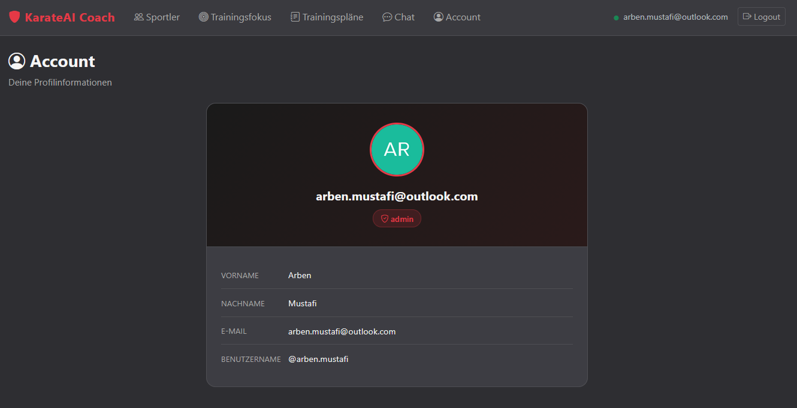

# KarateAI Coach

KarateAI Coach ist eine webbasierte Anwendung zur KI-gestützten Erstellung und Verwaltung individueller Trainingspläne für Karateka.

Die Applikation generiert auf Basis eines vom Coach definierten Trainingsfokus personalisierte Trainingspläne mittels KI und ermöglicht die strukturierte Verwaltung des Trainingsfortschritts.

## Rollen

- **Sportler**
  - Kann eigenen Trainingsfokus (Feedback vom Coach) einsehen
  - Kann Trainingsplan aus Trainingsfokus generieren lassen
  - Kann eigene Trainingspläne einsehen
  - Kann mit dem KI-Assistenten chatten

- **Coach (Admin)**
  - Kann Sportler verwalten (erstellen, bearbeiten, löschen)
  - Kann Trainingsfokusse für Sportler erstellen und verwalten
  - Kann Trainingspläne verwalten und Status ändern (Aktiv → Abgeschlossen → Archiviert)

# Inhaltsverzeichnis
- [Einleitung](#einleitung)
    - [Explore-Board](#explore-board)
    - [Create-Board](#create-board)
    - [Evaluate-Board](#evaluate-board)
    - [Diskussion Feedback Pitch](#diskussion-feedback-pitch)
- [Anforderungen](#anforderungen)
    - [Use-Case Diagramm](#use-case-diagramm)
    - [Use-Case Beschreibung](#use-case-beschreibung)
    - [Fachliches Datenmodell](#fachliches-datenmodell)
    - [UI-Mockup](#ui-mockup)
- [Implementation](#implementation)
    - [Frontend](#frontend)
    - [KI-Funktionen](#ki-funktionen)
	- [Drittsysteme](#drittsysteme)
- [Fazit](#fazit)
    - [Stand der Implementation](#stand-der-implementation)
    
# Einleitung

## Explore-Board
### TRENDS & TECHNOLOGIE
- **Megatrends**
  - Digitalisierung des Sports
  - Datafication / Quantified Self
  - Künstliche Intelligenz im Alltag
  - Individualisierung von Services
  - Plattformökonomie

- **Soziokulturelle Trends**
  - Leistungsoptimierung im Sport
  - Selbstoptimierung & Performance-Mindset
  - Hybrid Coaching (offline + digital)
  - Transparenz durch Daten

- **Konsum- & Zeitgeisttrends**
  - Fitness-Apps & Wearables
  - Mobile-first Nutzung
  - Gamification im Training
  - Abo-Modelle im digitalen Bereich

- **Technologien**
  - Large Language Models zur Trainingsplanung
  - Cloud Computing
  - MongoDB (NoSQL-Datenbank)
  - Rollenbasierte Authentifizierung
  - Web-App (SaaS-Modell)

### POTENTIELLE PARTNER & WETTBEWERB
- **Potenzielle Partner**
  - Nationale Karate-Verbände (z. B. Swiss Karate Federation)
  - Karate-Vereine und Leistungszentren
  - Sportwissenschaftliche Institute
  - Wearable-Hersteller (z. B. Garmin, Polar)
  - Turnierveranstalter
  - Videoanalyse-Plattformen

- **Wettbewerb**
  - Allgemeine Trainingsplan-Apps (z. B. Freeletics)
  - Fitness-Tracking-Apps
  - Individuelle Excel- oder Notion-Lösungen
  - Klassische PDF-Trainingspläne
  - Trainerinterne, nicht-digitale Planungssysteme

### FAKTEN
- Leistungs-Karate ist stark wettkampforientiert
- Trainingsplanung erfolgt häufig manuell oder erfahrungsbasiert
- Trainer betreuen mehrere Sportler gleichzeitig
- Trainingsschwerpunkte ändern sich je nach Wettkampfphase (Periodisierung)
- Leistungsdaten sind sensibel und unterliegen Datenschutzbestimmungen
- KI wird im Sport bisher hauptsächlich im Profibereich eingesetzt
- Es existieren kaum spezialisierte digitale Lösungen für Kampfsportarten
- Fortschrittsmessung erfolgt oft subjektiv statt datenbasiert

### USER
- **Primäre Nutzer**
  - Leistungsorientierte Karateka
  - Nachwuchssportler mit Wettkampffokus
  - Nationalkader-Athleten

- **Sekundäre Nutzer**
  - Karate-Trainer
  - Vereinstrainer
  - Leistungskoordinatoren

- **Charakteristika**
  - Zielorientiert
  - Hohe Trainingsfrequenz
  - Wettkampforientiert
  - Diszipliniert und strukturiert
  - Offen für Leistungsverbesserung

### POTENZIALFELDER
- Leistungssteigerung
- Strukturierte Trainingsplanung
- Fortschrittsmessung und Analyse
- Wettkampfvorbereitung
- Individualisierung von Trainingsplänen
- Trainer-Sportler-Kommunikation
- Verletzungsprävention
- Langfristige Leistungsentwicklung

### ERKENNTNISSE
- **Allgemeine Erkenntnisse**
  - Trainingsplanung ist häufig erfahrungsbasiert statt datenbasiert
  - Digitale Tools im Kampfsport sind wenig spezialisiert
  - Viele Trainer nutzen eigene, nicht standardisierte Systeme

- **Funktionale Erkenntnisse**
  - Sportler wünschen sich klare und strukturierte Trainingsvorgaben
  - Trainer benötigen Überblick über mehrere Athleten gleichzeitig
  - Trainingsschwerpunkte ändern sich je nach Wettkampfphase

- **Emotionale Erkenntnisse**
  - Unsicherheit vor wichtigen Wettkämpfen
  - Frustration bei stagnierender Leistung
  - Motivation durch sichtbaren Fortschritt

- **Soziale Erkenntnisse**
  - Trainer sind zentrale Autoritätspersonen
  - Regelmäßiges Feedback stärkt Vertrauen und Motivation
  - Leistungsbewertung erfolgt häufig im Vergleich zu anderen Athleten

### BEDÜRFNISSE
- Klare und strukturierte Trainingsplanung
- Individuell angepasste Trainingspläne
- Transparenz über Leistungsfortschritt
- Sicherheit in der Wettkampfvorbereitung
- Effiziente Kommunikation zwischen Trainer und Sportler
- Objektive und nachvollziehbare Leistungsanalyse
- Motivation durch messbare Entwicklung

### TOUCHPOINTS
- Smartphone während oder nach dem Training
- Laptop oder Tablet zur Trainingsplanung
- Trainingshalle / Dojo
- Wettkämpfe und Turnierplattformen
- Vereinskommunikation (z. B. WhatsApp, E-Mail)
- Videoanalyse-Tools
- Wearables und Fitness-Tracker
- Persönliche Trainer-Gespräche

### WIE KÖNNEN WIR?
Wie können wir leistungsorientierte Karateka und ihre Trainer dabei unterstützen, Trainingsplanung und Leistungsentwicklung datenbasiert, strukturiert und individuell zu gestalten, um Wettkampfleistungen gezielt zu verbessern?

## Create-Board
### IDEEN-BESCHREIBUNG
KarateAI Coach ist eine KI-gestützte Webanwendung, die auf Basis eines vom Trainer definierten Trainingsfokus automatisch strukturierte Trainingspläne für leistungsorientierte Karateka generiert.  
Die Plattform verbindet Trainerexpertise mit datenbasierter Trainingsplanung und ermöglicht eine transparente Fortschrittsanalyse.

### ADRESSIERTE NUTZER
- Leistungsorientierte Karateka mit Wettkampffokus
- Trainer im Leistungs- und Nachwuchsbereich

### ADRESSIERTE BEDÜRFNISSE
- Strukturierte und individuelle Trainingsplanung
- Transparenz über Leistungsfortschritt
- Sicherheit in der Wettkampfvorbereitung
- Effiziente Trainer-Sportler-Kommunikation

### PROBLEME
- Trainingsplanung erfolgt oft unsystematisch oder rein erfahrungsbasiert
- Fortschritte sind schwer messbar und wenig dokumentiert
- Trainer verlieren bei mehreren Athleten schnell den Überblick

### IDEENPOTENZIAL
- **Mehrwert (User Value):** 7/10
- **Übertragbarkeit (Scalability):** 6/10
- **Machbarkeit (Feasibility):** 7/10

### DAS WOW
Automatische Generierung eines strukturierten, wettkampforientierten Trainingsplans auf Basis eines klar definierten Trainingsfokus – inklusive Fortschrittsverfolgung und Statusverwaltung.

### HIGH-LEVEL-KONZEPT
„Notion für Karate-Coaches – kombiniert mit KI-gestützter Trainingsplanung."

### WERTVERSPRECHEN
KarateAI Coach ermöglicht leistungsorientierten Karateka und ihren Trainern eine strukturierte, datenbasierte und individuell zugeschnittene Trainingsplanung, um Wettkampfleistungen gezielt und messbar zu verbessern.

## Evaluate-Board
### KANÄLE
- Social Media (Instagram, TikTok – sportbezogener Content)
- Direktansprache über Karate-Vereine und Leistungszentren
- Kooperationen mit Verbänden
- Präsentationen bei Trainer-Weiterbildungen
- Empfehlungsmarketing unter Athleten
- Website mit Demo-Zugang
- E-Mail-Newsletter für Trainer

### UNFAIRER VORTEIL
- Kombination aus Trainer-definiertem Trainingsfokus und KI-Generierung
- Spezialisierung auf Wettkampf-Karate (starker Nischenfokus)
- Integration von Trainingsstatus und Fortschrittsanalyse
- Fachliches Know-how im Leistungs-Karate
- Frühe Partnerschaften mit Verbänden oder Leistungszentren

### KPI
- Anzahl registrierter Sportler
- Anzahl aktiver Trainer
- Anzahl generierter Trainingspläne pro Monat
- Nutzeraktivität (wöchentliche Logins)
- Retention-Rate nach 3 Monaten
- Anzahl Empfehlungen durch bestehende Nutzer
- Conversion-Rate von Testversion zu Bezahlmodell

### EINNAHMEQUELLEN
- Monatliches Abonnement für Trainer (SaaS-Modell)
- Vereinslizenz für Leistungszentren
- Freemium-Modell für Sportler mit kostenpflichtigen Premium-Funktionen
- Kooperationen mit Verbänden
- Sponsoring durch Sportmarken

## Diskussion Feedback Pitch

**Positives Feedback:**
- Die Idee ist klar und der Anwendungsfall direkt nachvollziehbar — man versteht sofort, welches Problem gelöst wird
- Die Kombination aus Trainer-definiertem Trainingsfokus und KI-Generierung wurde als elegante Lösung gelobt

**Kritisches Feedback / Fragen:**
- Der Workflow zwischen Trainer und Sportler war nicht ganz klar — muss der Trainer zuerst aktiv einen Fokus setzen, bevor der Sportler einen Plan generieren kann?
- Die Zielgruppe (Leistungskarateka) ist sehr spezifisch — ob das Modell auf andere Kampfsportarten erweiterbar wäre, wurde hinterfragt
- Eine mobile App wäre für den Einsatz direkt in der Trainingshalle sinnvoller als eine Web-App

# Anforderungen

## Use-Case Diagramm

## Use-Case Beschreibung

### Use Case Description

**ID:** 1  
**Title:** Registrieren  

**Pre-Conditions:**  
- Keine.  

**Actors:**  
Sportler  

**Sequence:**  
1. Sportler ruft die Registrierungsseite auf.  
2. Sportler gibt Name, E-Mail und Passwort ein.  
3. System erstellt ein Konto via Auth0.  
4. Sportler wird zur Startseite weitergeleitet.  

**Data Definitions:**  
Name: Typ Text  
E-Mail: Typ Text  
Passwort: Typ Passwort  

**Exception:**  
- E-Mail bereits vorhanden → Fehlermeldung wird angezeigt.  
- Ungültige E-Mail-Adresse → Registrierung nicht möglich.  

---

### Use Case Description

**ID:** 2  
**Title:** Login  

**Pre-Conditions:**  
- Sportler oder Coach besitzt ein registriertes Konto.  

**Actors:**  
Sportler, Coach  

**Sequence:**  
1. Benutzer ruft die Login-Seite auf.  
2. Benutzer gibt E-Mail und Passwort ein.  
3. System prüft die Zugangsdaten via Auth0.  
4. Benutzer wird zur Startseite weitergeleitet.  

**Data Definitions:**  
E-Mail: Typ Text  
Passwort: Typ Passwort  

**Exception:**  
- Falsche E-Mail oder Passwort → Fehlermeldung wird angezeigt, Login-Seite wird erneut angezeigt.  
- Kein Konto vorhanden → Anmeldung schlägt fehl.  

---

### Use Case Description

**ID:** 3  
**Title:** Profil verwalten  

**Pre-Conditions:**  
- Sportler ist erfolgreich eingeloggt (UC 2 Login).  

**Actors:**  
Sportler  

**Sequence:**  
1. Sportler navigiert zur Account-Seite.  
2. Sportler aktualisiert Gürtelgrad und/oder Gewicht.  
3. Sportler speichert die Änderungen.  
4. System aktualisiert das Profil und zeigt eine Bestätigung an.  

**Data Definitions:**  
Gürtelgrad: Typ Text  
Gewicht: Typ Zahl  

**Exception:**  
- Sportler-Profil nicht gefunden → Fehlermeldung wird angezeigt.  

---

### Use Case Description

**ID:** 4  
**Title:** Trainingsplan generieren  

**Pre-Conditions:**  
- Sportler ist erfolgreich eingeloggt (UC 2 Login).  
- Es existiert ein aktiver Trainingsfokus für den Sportler.  

**Actors:**  
Sportler  

**Sequence:**  
1. Sportler navigiert zur Seite „Meine Trainingspläne”.  
2. Sportler wählt einen aktiven Trainingsfokus aus.  
3. Sportler klickt auf „Trainingsplan generieren”.  
4. System übergibt den Trainingsfokus an die KI (UC 5).  
5. Trainingsplan wird gespeichert und angezeigt.  

**Data Definitions:**  
Trainingsfokus: Typ Text  
Titel: Typ Text  
Dauer: Typ Zahl  
Status: Typ Text  

**Exception:**  
- Kein aktiver Trainingsfokus vorhanden → Generierung nicht möglich.  
- Fehler bei KI-Generierung → Fehlermeldung wird angezeigt.  

---

### Use Case Description

**ID:** 5  
**Title:** KI-Trainingsplan generieren lassen  

**Pre-Conditions:**  
- UC 4 Trainingsplan generieren wurde ausgelöst.  
- Trainingsfokus ist vollständig befüllt.  

**Actors:**  
Sportler  

**Sequence:**  
1. System sendet Trainingsfokus, Gürtelgrad und Gewicht an das KI-Modell.  
2. KI generiert einen detaillierten, strukturierten Trainingsplan.  
3. System speichert den generierten Plan in der Datenbank.  
4. Trainingsplan wird dem Sportler angezeigt.  

**Data Definitions:**  
Schwerpunkt: Typ Text  
Kategorie: Typ Text  
Dauer in Wochen: Typ Zahl  
Einheiten pro Woche: Typ Zahl  
Minuten pro Einheit: Typ Zahl  
Inhalt (KI-generiert): Typ Text  

**Exception:**  
- KI-Modell nicht erreichbar → Fehlermeldung wird angezeigt.  
- Bereits ein Plan für diesen Fokus vorhanden → Bestehender Plan wird zurückgegeben.  

---

### Use Case Description

**ID:** 6  
**Title:** Trainingsfokus einsehen  

**Pre-Conditions:**  
- Sportler ist erfolgreich eingeloggt (UC 2 Login).  

**Actors:**  
Sportler  

**Sequence:**  
1. Sportler navigiert zur Seite „Mein Feedback”.  
2. System lädt alle Trainingsfokusse des Sportlers.  
3. Sportler wählt einen Trainingsfokus aus und sieht die Details.  
4. System markiert den Trainingsfokus als gelesen.  

**Data Definitions:**  
Schwerpunkt: Typ Text  
Kategorie: Typ Text  
Notiz: Typ Text  
Status: Typ Text  
Gelesen: Typ Boolean  

**Exception:**  
- Kein Trainingsfokus vorhanden → Hinweis wird angezeigt.  

---

### Use Case Description

**ID:** 7  
**Title:** Trainingsplan einsehen  

**Pre-Conditions:**  
- Sportler ist erfolgreich eingeloggt (UC 2 Login).  

**Actors:**  
Sportler  

**Sequence:**  
1. Sportler navigiert zur Seite „Meine Trainingspläne”.  
2. System lädt alle Trainingspläne des Sportlers.  
3. Sportler wählt einen Trainingsplan aus und sieht den Inhalt.  

**Data Definitions:**  
Titel: Typ Text  
Inhalt: Typ Text  
Status: Typ Text  
Dauer: Typ Zahl  

**Exception:**  
- Kein Trainingsplan vorhanden → Hinweis wird angezeigt.  

---

### Use Case Description

**ID:** 8  
**Title:** Mit KI chatten  

**Pre-Conditions:**  
- Sportler ist erfolgreich eingeloggt (UC 2 Login).  

**Actors:**  
Sportler  

**Sequence:**  
1. Sportler navigiert zur Chat-Seite.  
2. Sportler gibt eine Nachricht ein und sendet sie (Enter oder Button).  
3. System sendet die Nachricht an das KI-Modell.  
4. KI-Antwort wird angezeigt.  

**Data Definitions:**  
Nachricht: Typ Text  
Antwort: Typ Text  

**Exception:**  
- KI-Modell nicht erreichbar → Fehlermeldung wird angezeigt.  

---

### Use Case Description

**ID:** 9  
**Title:** Sportler verwalten  

**Pre-Conditions:**  
- Coach ist erfolgreich eingeloggt (UC 2 Login).  

**Actors:**  
Coach  

**Sequence:**  
1. Coach navigiert zur Sportler-Verwaltungsseite.  
2. Coach kann Sportler suchen, filtern, erstellen oder löschen.  
3. System speichert die Änderungen und aktualisiert die Liste.  

**Data Definitions:**  
Name: Typ Text  
E-Mail: Typ Text  
Gürtelgrad: Typ Text  
Gewicht: Typ Zahl  

**Exception:**  
- E-Mail bereits vorhanden → 409 Conflict, Fehlermeldung wird angezeigt.  
- Ungültige E-Mail → 400 Bad Request, Fehlermeldung wird angezeigt.  
- Sportler nicht gefunden → 404 Not Found.  

---

### Use Case Description

**ID:** 10  
**Title:** Trainingsfokus definieren  

**Pre-Conditions:**  
- Coach ist erfolgreich eingeloggt (UC 2 Login).  
- Sportler existiert im System.  

**Actors:**  
Coach  

**Sequence:**  
1. Coach navigiert zur Trainingsfokus-Seite.  
2. Coach wählt einen Sportler aus und erfasst Schwerpunkt, Kategorie und Notiz.  
3. Coach setzt optional Turniername, Turnierdatum, Dauer und Einheiten.  
4. Trainingsfokus wird gespeichert.  

**Data Definitions:**  
Schwerpunkt: Typ Text  
Kategorie: Typ Text  
Notiz: Typ Text  
Status: Typ Text  
Dauer in Wochen: Typ Zahl  
Einheiten pro Woche: Typ Zahl  
Minuten pro Einheit: Typ Zahl  
Turniername: Typ Text  
Turnierdatum: Typ Zeit  

**Exception:**  
- Sportler existiert nicht → Trainingsfokus kann nicht erstellt werden.  

---

### Use Case Description

**ID:** 11  
**Title:** Trainingsfokus verwalten  

**Pre-Conditions:**  
- Coach ist erfolgreich eingeloggt (UC 2 Login).  
- Trainingsfokus existiert im System.  

**Actors:**  
Coach  

**Sequence:**  
1. Coach navigiert zur Trainingsfokus-Seite.  
2. Coach kann den Status eines Trainingsfokus auf AKTIV oder INAKTIV setzen.  
3. Coach kann einen Trainingsfokus löschen.  
4. System speichert die Änderungen.  

**Data Definitions:**  
Status: Typ Text (AKTIV, INAKTIV)  

**Exception:**  
- Trainingsfokus nicht gefunden → 404 Not Found.  
- Ungültiger Status → 400 Bad Request.  

---

### Use Case Description

**ID:** 12  
**Title:** Trainingspläne verwalten  

**Pre-Conditions:**  
- Coach ist erfolgreich eingeloggt (UC 2 Login).  
- Trainingsplan existiert im System.  

**Actors:**  
Coach  

**Sequence:**  
1. Coach navigiert zur Trainingsplan-Verwaltungsseite.  
2. Coach kann Trainingspläne filtern und einsehen.  
3. Coach kann den Status eines Trainingsplans ändern (Aktiv → Abgeschlossen).  
4. System speichert die Änderungen und sendet eine E-Mail an den Sportler.  

**Data Definitions:**  
Titel: Typ Text  
Status: Typ Text (ACTIVE, COMPLETED)  
Dauer: Typ Zahl  

**Exception:**  
- Trainingsplan nicht gefunden → 400 Bad Request.  
- Falscher Status für Übergang → Statusänderung nicht möglich.  

---

### Use Case Description

**ID:** 13  
**Title:** Trainingsplan archivieren  

**Pre-Conditions:**  
- Coach ist erfolgreich eingeloggt (UC 2 Login).  
- Trainingsplan hat den Status COMPLETED.  

**Actors:**  
Coach  

**Sequence:**  
1. Coach navigiert zur Trainingsplan-Verwaltungsseite.  
2. Coach wählt einen abgeschlossenen Trainingsplan aus.  
3. Coach klickt auf „Archivieren”.  
4. System setzt den Status auf ARCHIVED.  

**Data Definitions:**  
Status: Typ Text (COMPLETED → ARCHIVED)  

**Exception:**  
- Trainingsplan hat nicht den Status COMPLETED → Archivierung nicht möglich.  
- Trainingsplan nicht gefunden → 400 Bad Request.  

## Fachliches Datenmodell 
### ER-Diagramm

---

### Beschreibung des fachlichen Modells

Das fachliche Datenmodell bildet die zentrale Domänenlogik von **KarateAI Coach** ab.  
Es beschreibt ausschließlich fachliche Konzepte ohne technische Implementierungsdetails.

#### Zentrale Entitäten

**Sportler**
- Name
- E-Mail
- Gürtelgrad
- Gewicht

Ein Sportler wird von genau einem Coach betreut und kann mehrere Trainingsfokusse sowie mehrere Trainingspläne besitzen.

---

**Coach**
- Name
- E-Mail

Ein Coach betreut mehrere Sportler und definiert deren Trainingsfokusse.

---

**Trainingsfokus**
- Schwerpunkt
- Kategorie
- Status

Ein Trainingsfokus wird von einem Coach definiert und gehört genau einem Sportler.  
Er dient als fachliche Grundlage für die KI-gestützte Generierung von Trainingsplänen.  
Ein Sportler kann mehrere Trainingsfokusse besitzen (N:1 zu Sportler, N:1 zu Coach).

---

**Trainingsplan**
- Titel
- Erstelldatum
- Dauer
- Status

Ein Trainingsplan gehört genau einem Sportler und basiert auf einem Trainingsfokus.  
Er wird durch die Künstliche Intelligenz erstellt.

---

**Künstliche Intelligenz**
- Model
- API Key

Die Künstliche Intelligenz erstellt auf Basis eines Trainingsfokus automatisch einen strukturierten Trainingsplan. Sie wird vom System aufgerufen und kann mehrere Trainingspläne generieren (1:N zu Trainingsplan).

---

### Zustände im System

Folgende Entitäten besitzen fachliche Zustände:

**Trainingsplan**
- ACTIVE — Plan ist aktiv und wird verwendet
- COMPLETED — Plan wurde abgeschlossen
- ARCHIVED — Plan ist archiviert

**Trainingsfokus**
- AKTIV — Fokus ist aktiv und für den Sportler sichtbar
- INAKTIV — Fokus ist deaktiviert

Diese Zustände steuern die fachliche Logik des Systems. Ein Trainingsplan kann nur aus einem aktiven Trainingsfokus generiert werden. Der Trainingsplan durchläuft die Zustände ACTIVE → COMPLETED → ARCHIVED.

## UI-Mockup

### Startseite (nicht eingeloggt)

### Dashboard

### Sportler

### Trainingsfokus

### KI-Assistent

### Account

# Implementation

## Frontend
> Beschreibung des Frontends mit Screenshots der fertigen Applikation. Alle Teile des GUIs, die bewertet werden sollen, müssen abgebildet sein.

## KI-Funktionen

Die Anwendung verwendet **Spring AI** mit dem **OpenAI GPT-Modell** (Claude-kompatibel) für drei unterschiedliche KI-Funktionen.

---

### 1. KI-Chat-Assistent

Der Sportler kann über die Chat-Seite direkt mit dem KI-Karate-Coach kommunizieren. Die Nachricht wird an das KI-Modell gesendet und die Antwort wird in Echtzeit angezeigt. Falls die Nachricht einen Trainingsplan-Befehl enthält (Stichwort „Trainingsplan" und „Schwerpunkt:"), wird der generierte Plan automatisch in der Datenbank gespeichert.

**Relevante Code-Stelle:** [ChatController.java:34](src/main/java/ch/zhaw/karateaicoach/controller/ChatController.java#L34)

---

### 2. KI-Generierung eines Trainingsplans aus Trainingsfokus

Wenn ein Sportler auf „Trainingsplan generieren" klickt, wird ein detaillierter, wettkampforientierter Trainingsplan durch die KI erstellt. Der Prompt enthält Informationen aus dem Trainingsfokus (Schwerpunkt, Kategorie, Dauer, Einheiten, Turnierdaten) sowie die Sportler-Daten (Gürtelgrad, Gewicht, Name). Die KI gibt einen strukturierten Plan mit Wochen, Aufwärmen, Hauptteil und Cooldown zurück.

**Relevante Code-Stelle:** [TrainingsplanController.java:109-129](src/main/java/ch/zhaw/karateaicoach/controller/TrainingsplanController.java#L109)

---

### 3. KI-gestützte Titelverbesserung

Beim manuellen Erstellen eines Trainingsplans durch den Coach wird der eingegebene Titel automatisch durch die KI optimiert. Das Modell berücksichtigt den Trainingsfokus und die Dauer und gibt einen verbesserten Titel zurück.

**Relevante Code-Stelle:** [TrainingsplanController.java:58-61](src/main/java/ch/zhaw/karateaicoach/controller/TrainingsplanController.java#L58)

---

### 4. KI-Tools (Function Calling)

Über Spring AI `@Tool`-Annotationen stellt das Backend der KI Datenbankzugriffe als aufrufbare Funktionen bereit. Die KI kann damit selbstständig Sportler und Trainingspläne abfragen oder erstellen.

| Tool | Beschreibung |
|---|---|
| `getAllSportler()` | Gibt alle Sportler aus der Datenbank zurück |
| `getAllTrainingsplaene()` | Gibt alle Trainingspläne zurück |
| `createSportler()` | Erstellt einen neuen Sportler |
| `createTrainingsplan()` | Erstellt einen neuen Trainingsplan |

**Relevante Code-Stelle:** [KarateTools.java](src/main/java/ch/zhaw/karateaicoach/tools/KarateTools.java)

## Optionale Anforderungen

### Codeanalyse mit SonarQube
Die Codequalität wird automatisch bei jedem Push mit SonarQube analysiert. Der Workflow ist als GitHub Action definiert.

**Relevante Code-Stelle:** [sonar.yml](.github/workflows/sonar.yml)

---

### Komplexes Datenmodell
Das Datenmodell umfasst 5 Entitäten (Sportler, Coach, Trainingsfokus, Trainingsplan, Künstliche Intelligenz) mit definierten Beziehungen und Zuständen. Trainingsfokus und Trainingsplan durchlaufen jeweils mehrere Zustände.

---

### Komplexes Frontend
Das Frontend ist mit SvelteKit umgesetzt und beinhaltet rollenbasierte Navigation, Paginierung, Filterung, animierte Seitenübergänge, modale Dialoge, Echtzeit-Chat und eine Login-Benachrichtigung bei ungelesen Feedback.

---

### Zugriff auf Drittsysteme
Die Anwendung integriert drei externe Systeme:
- **Auth0** — Authentifizierung und Rollenverwaltung
- **OpenAI / Spring AI** — KI-Generierung von Trainingsplänen
- **Mailservice** — automatischer E-Mail-Versand bei Statusänderungen

---

### Backend mit MCP-Server (AI Tools)
Das Backend stellt der KI über Spring AI `@Tool`-Annotationen Datenbankfunktionen als aufrufbare Tools bereit (Function Calling).

**Relevante Code-Stelle:** [KarateTools.java](src/main/java/ch/zhaw/karateaicoach/tools/KarateTools.java)

---

### Komplexe Benutzerverwaltung
Die Benutzerverwaltung basiert auf Auth0 mit zwei Rollen (Admin/Coach und Sportler). Alle API-Endpoints sind rollenbasiert geschützt. Die Rolle wird aus dem JWT-Token ausgelesen.

**Relevante Code-Stelle:** [UserService.java](src/main/java/ch/zhaw/karateaicoach/service/UserService.java)

---

### Komplexe Abfragen auf der Datenbank
Die Repositories beinhalten mehrere komplexe MongoDB-Abfragen mit Filterung, Paginierung und einer Aggregation für das Dashboard.

| Abfrage | Beschreibung |
|---|---|
| `findByDauerGreaterThanAndStatus` | Kombinierter Filter nach Dauer und Status |
| `findByStatusAndSportlerIdIn` | Filter nach Status und mehreren Sportler-IDs |
| `getTrainingsplanStatusAggregation` | MongoDB Aggregation: gruppiert Pläne nach Status |

**Relevante Code-Stelle:** [TrainingsplanRepository.java:30-34](src/main/java/ch/zhaw/karateaicoach/repository/TrainingsplanRepository.java#L30)

---

### Detaillierte Dokumentation auf GitHub
Alle Issues sind mit Beschreibung, Labels und Akzeptanzkriterien dokumentiert. Es werden über 20 verschiedene Labels verwendet. Issues sind Sprints (Iterations) zugeordnet und durchlaufen die SCRUM-Board-Spalten Ready → In Progress → Done.

---

### Mehrere Branches
Feature-Branches werden pro Issue erstellt und nach Abschluss in `main` gemergt. Die Branch-Namen referenzieren direkt die Issue-Nummer (z.B. `9-api-endpoint-get-all-trainingsplan`).

# Fazit

## Stand der Implementation
> Stand der Implementation, nächste Schritte (mit Referenz auf den Backlog).